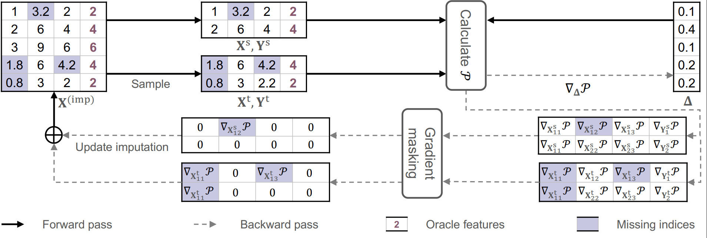

# Kernel Point Imputation (KPI)

This repository contains the official implementation of **KPI: A Generalized Iterative Imputation Framework for Model Adaptation and Oracle Feature Utilization**.

## 🔍 Overview


Iterative imputation is widely used to handle missing data by sequentially imputing each feature using the others as predictors. However, existing methods suffer from:

1. **Model Misspecification**: Applying the same model structure to all features ignores the heterogeneity in their underlying data-generating processes.
2. **Underutilization of Oracle Features**: Fully observed (oracle) features are treated the same as partially missing ones, leading to suboptimal imputations.

To address these issues, we propose **Kernel Point Imputation (KPI)**, a **bi-level optimization framework** that:

- **Adapts model forms per feature** using functional optimization in a Reproducing Kernel Hilbert Space (RKHS).
- **Leverages oracle (fully observed) features** to provide informative supervision signals during the outer optimization stage.

## 🧠 Key Contributions

- A **flexible model adaptation** mechanism that avoids uniform parametric assumptions.
- A **bi-level learning framework** that exploits oracle features for more accurate and robust imputations.
- **Superior performance** across various real-world benchmarks with heterogeneous and partially observed datasets.


## 🧪 Reproducing Results

### 1. Environment Setup
Install Python 3.10 and required dependencies:
```bash
pip install -r requirements.txt
```


### 2. Data Preparation
Obtain preprocessed datasets from the [UCI Machine Learning Repository](https://archive.ics.uci.edu), then place the downloaded data in the `./dataset` folder.

Supported datasets summary:


### 3. Train and Evaluate
Experiment scripts for all benchmarks are provided under the `./scripts/` folder. Reproduce results with example commands like:
```bash
bash scripts/bt.sh
```
### 🔧 Optional: Docker Environment 

For users who prefer containerized environments, we provide a lightweight `Dockerfile` that sets up a Conda-based environment named `kpi`. This environment includes Python 3.10 and several pre-installed base packages.

> ⚠️ **Note**: The Docker image includes **only a partial installation** of the dependencies. You still need to activate the Conda environment and install the remaining packages via `requirements.txt`.

#### 1. Build the Docker image

```bash
docker build -t kpi-conda .
```

#### 2. Run the container

```bash
docker run {your args} -it kpi-conda /bin/bash
```
For example, to mount the current directory and work inside it:
```
docker run  --rm -v $(pwd):/app -w /app -it kpi-conda /bin/bash
```


#### 3. Inside the container

##### Activate the conda environment
```
conda activate kpi
```
##### Install the remaining dependencies
```
pip install -r requirements.txt
```
# Run your experiment
```
bash scripts/bt.sh
```

This setup is useful for users who want a consistent, containerized environment with Conda. 


## Acknowledgements

We gratefully acknowledge the UCI Machine Learning Repository for providing the datasets used in this work. The availability of high-quality, well-documented, and openly accessible datasets is critical to the development, evaluation, and reproducibility of machine learning research. We appreciate the efforts of the UCI community in curating and maintaining this valuable resource, which continues to support and accelerate progress in the broader data science community.


